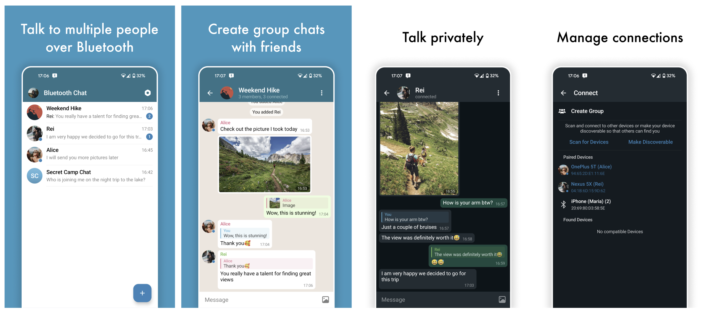

# Bluetooth Chat - Group&Private

Inspired by [Bluetooth Chat](https://github.com/glodanif/BluetoothChat)

This project wasn't originally meant to be open source (e. g. I didn't think anybody else would ever see this code 😅), so there are some cut corners here and there.

License
--------
    Copyright 2024 Yurii Navizovskyi

    Licensed under the Apache License, Version 2.0 (the "License");
    you may not use this file except in compliance with the License.
    You may obtain a copy of the License at

        http://www.apache.org/licenses/LICENSE-2.0

    Unless required by applicable law or agreed to in writing, software
    distributed under the License is distributed on an "AS IS" BASIS,
    WITHOUT WARRANTIES OR CONDITIONS OF ANY KIND, either express or implied.
    See the License for the specific language governing permissions and
    limitations under the License.
